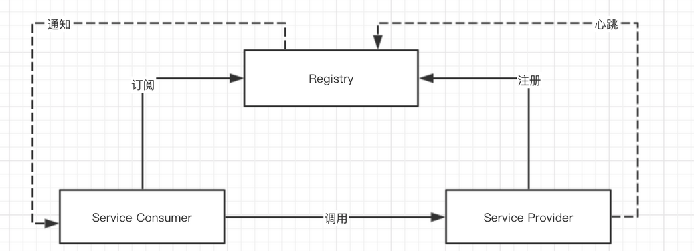

# Nacos注册中心
将Nacos作为一个注册中心，实现分布式环境下的服务注册和发现
## 注册中心原理
在使用注册中心时，一共三种角色：服务提供者（Service Provider）、服务消费者（Service Consumer）、注册中心（Register）
三个角色的交互如下图

服务提供者：在启动时，向注册中心注册自己为一个服务的实例
同时定期向注册中心发送心跳，告诉注册中心自己还存活
关闭时，向注册中心取消注册

服务消费者：启动时，向注册中心订阅使用到的服务，并缓存服务的实例到自己的内存中。
后续，服务消费者向对应的服务提供者发起调用的时候，从内存中该服务的实例列表中选择一个，进行远程调用。
关闭时，向服务注册中心取消订阅。

注册中心：如果服务提供者超过一定时间未发送心跳，从服务的实例列表中移除。
服务的实例列表发生变化（新增或者移除）时，通知订阅该服务的消费者，从而让消费者能够刷新本地缓存。

