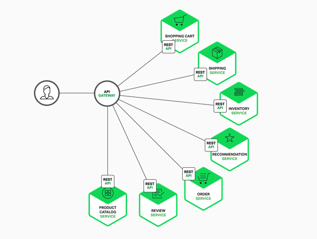
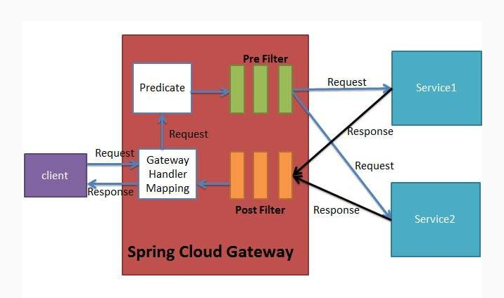

# Spring Cloud Gateway
Spring Cloud Gateway是WebFlux + Netty + Reactor实现的响应式API网关。

API网关可以接管所有的入口流量，类似Nginx的作用，将所有用户的请求转发给后端的服务器，但网关做的不仅是简单的
转发，也会针对流量做一些扩展，比如鉴权、限流、权限、熔断、协议转换、错误码统一、缓存、日志、监控、告警等，这样通用
的逻辑抽出来，由网关统一去做，业务方也能够更专注于业务逻辑。

通过引入API网关，客户端只需要与API网关交互，而不用与各个业务方的接口分别通讯。

## 协议转换
微服务内部的API可能是由很多种不同的协议实现的，例如HTTP、Dubbo、gRPC等，需要在网关
层做一次协议转换，将用户的HTTP协议请求，在网关层转换成底层对应的协议，例如HTTP->Dubbo。

## 服务发现
网关可以基于注册中心进行转发与寻址。

## 整体架构

1. Gateway接收客户端请求
2. 请求与Predicate进行匹配，获得到对应的Route。匹配成功后，才能继续往下执行。
3. 请求经过Filter过滤器，执行前置处理逻辑
4. 请求被Proxy Filter转发至目标URI,并最终获得响应。（一般来说，目标URI是被代理的微服务）
5. 响应经过Filter过滤器链，执行后置处理逻辑
6. Gateway返回响应给客户端
