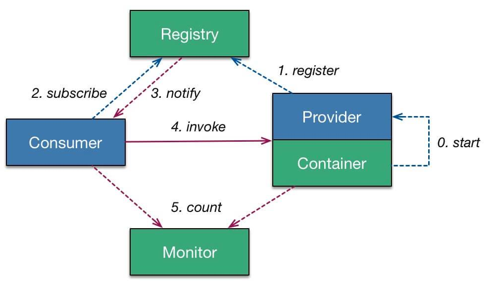

# Dubbo
## Dubbo的功能
Dubbo提供三大核心功能：面向接口的远程方法调用、智能容错和负载均衡、服务的自动注册和发现
## Dubbo的架构
Dubbo的架构如下所示：

0. 服务容器负责启动、加载、运行服务提供者
1. 服务提供者在启动时，向注册中心注册自己提供的服务
2. 服务消费者在启动时，向服务中心订阅自己所需的服务
3. 注册中心返回服务提供者地址列表给消费者，如果有变更，注册中心将基于长连接推送变更数据给消费者
4. 服务消费者，从提供者地址列表中，基于软负载均衡算法，选一台提供者进行调用，如果调用失败，再选另一台调用
5. 服务消费者和提供者，再内存中累计调用次数和调用时间，定时每分钟发送一次统计数据到监控中心

