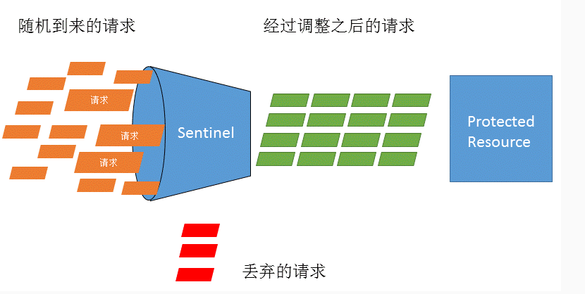
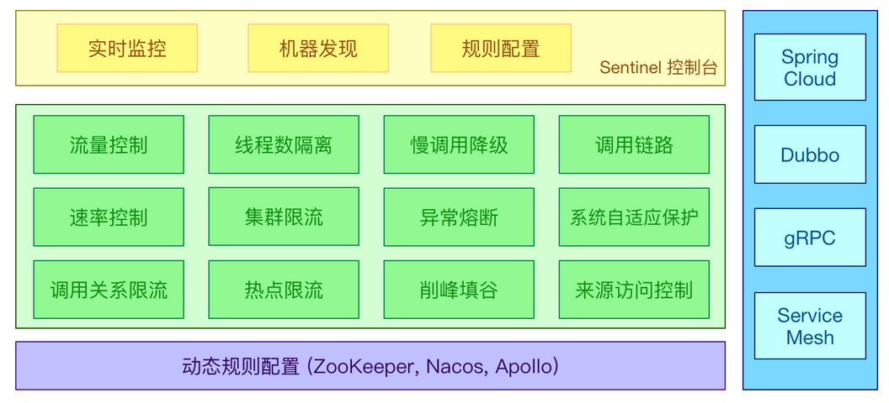

# Sentinel 服务容错
## 流量控制
流量控制用于调整网络包的发送数据，根据系统的处理能力对流量进行控制，Sentinel
作为一个调配器，可以根据需要把随机的请求调整成合适的形状。
监控应用流量的QPS或并发线程数等指标，当达到指定的阈值时对流量进行控制，以避免被
瞬时的流量高峰冲垮，从而保障应用的高可用性。
限流的直接表现时在执行Entry nodeA = SphU.entry(resourceName) 的时候抛出 FlowException 异常。FlowException 是 BlockException 的子类，可以捕捉 BlockException 来自定义被限流之后的处理逻辑。

流量控制有一下几个角度：
+ 资源的调用关系，例如资源的调用链路，资源和资源之间的关系
+ 运行指标，例如QPS、线程池、系统负载等
+ 控制的效果，例如直接限流、冷启动、排队等

## Sentinel的主要特性

## Sentinel的组成

Sentinel分为两个部分
+ 核心库（Java客户端）：不依赖任何框架/库，能够运行所有Java运行时环境。
+ 控制台 启动控制台的命令为：nohup java -Dserver.port=7070 -jar sentinel-dashboard-1.8.1.jar &